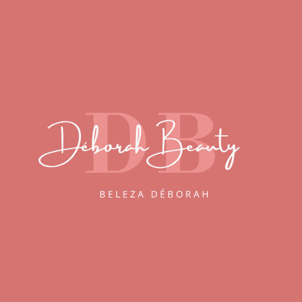
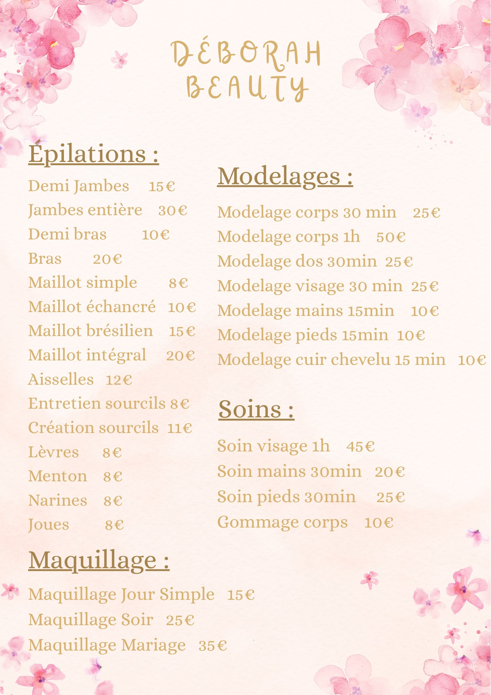
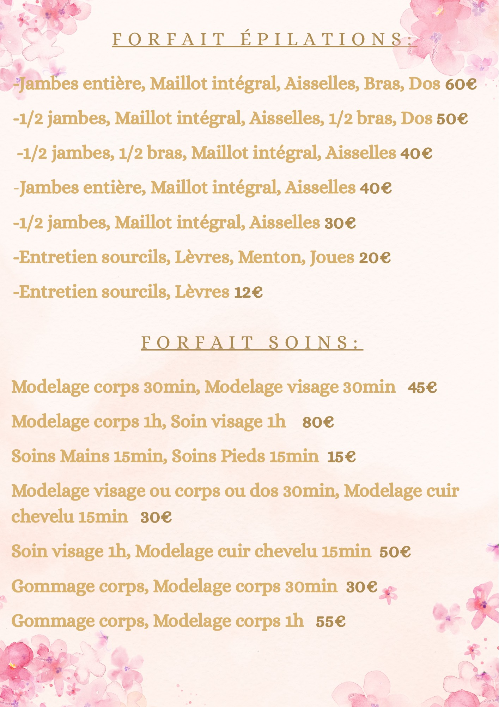
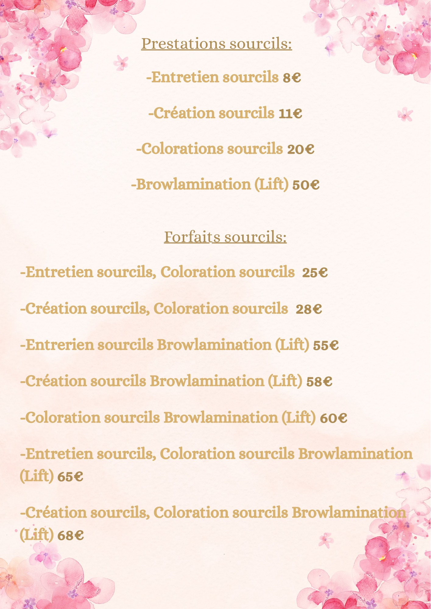

<!doctype html>
    <html>
        <head>
            <link
            rel="stylesheet"
            href="https://cdn.jsdelivr.net/npm/bulma@1.0.0/css/bulma.min.css">
            <link rel="stylesheet" href="./style.css"/>
		<meta charset="UTF-8" />
  		<meta name="viewport" content="width=device-width, initial-scale=1.0">
		<title>Deborah Beauty</title>
        </head>
        <body>
            

        <nav class="navbar" role="navigation" aria-label="main-navigation">
            

            

                   
  

    

      <a class="navbar-item" href="index.html">Menu</a>
      <a class="navbar-item" href="nos prestation.html" target="_blank">Les Prestations</a>
      <a class="navbar-item" href="nos techniques.html">Les Techniques</a>
      <a class="navbar-item" href="nos prix.html">Tarifs</a>
    

  

            </nav>
            
             

                
Prestations ouverte à domiciles 7J/7J

                    
"La détente est le meilleur remede contre le stresse"

                    
Pas de stresse y'a Deborah Beauty

                    
             

         <footer class="footer">
                    

                        

                            

                                <h2>Mes Contacts</h2>
                                

                                    Téléphone: 06.50.47.30.47 
                                    Instagram: beleza_deborah 
                                    Email: deborahbeleza8@gmail.com 
                                

                            

                        

                    

                </footer>
                
</body>
    </html>
    <!doctype html>
    <html>
        <head>
            <link
            rel="stylesheet"
            href="https://cdn.jsdelivr.net/npm/bulma@1.0.0/css/bulma.min.css">
            <link rel="stylesheet" href="./style.css"/>
            <link rel="stylesheet" href="https://cdnjs.cloudflare.com/ajax/libs/font-awesome/6.5.0/css/all.min.css">
		<meta charset="UTF-8" />
  		<meta name="viewport" content="width=device-width, initial-scale=1.0">
		<title>Deborah Beauty</title>
        </head>
        <body>
            

        <nav class="navbar" role="navigation" aria-label="main-navigation">
            

            

                   
  

    

        <a class="navbar-item" href="index.html">Menu</a>
      <a class="navbar-item" href="nos prestation.html" target="_blank">Les Prestations</a>
      <a class="navbar-item" href="nos techniques.html">Les Techniques</a>
      <a class="navbar-item" href="nos prix.html">Tarifs</a>
    

  

            </nav>
            
       

  <header class="card-header">
    
Epilations

    <button  class="card-header-icon toggle-button" aria-label="more options">
      
        <i class="fas fa-angle-down" aria-hidden="true"></i>
      
    </button>
  </header>
    

    

      
Epilation Sourcils 
      Epilation Lèvres
      Epilation Menton
      Epilation Narines
      Epilation Aisselles
      Epilation Bras et 1/2 Bras
      Epilation Jambes entières et 1/2 Jambes
      Epilation Maillot simple, échancré, brésilien, intégral
      Epilation Dos et ventre
      

    

  

  <header class="card-header">
    
Modelages

    <button class="card-header-icon toggle-button" aria-label="more options">
      
        <i class="fas fa-angle-down" aria-hidden="true"></i>
      
    </button>
  </header>
    

    

      
Modelage Corps 30min, 1h
      Modelage Visage 30min, 1h
      Modelage Mains 15min
      Modelage Pieds 15min 
      Modelage Cuir chevelu 15min 
      

    

  

  <header class="card-header">
    
Soins

    <button  class="card-header-icon toggle-button" aria-label="more options">
      
        <i class="fas fa-angle-down" aria-hidden="true"></i>
      
    </button>
  </header>
    

    

      
Gommage corps 20min 
     Soin Visage 60min Hydratant, Matifiant, Anti-âge
      Soin des mains 45min
      Soin des pieds 45min 
      

    

  

  <header class="card-header">
    
Sourcils

    <button class="card-header-icon toggle-button" aria-label="more options">
      
        <i class="fas fa-angle-down" aria-hidden="true"></i>
      
    </button>
  </header>
    

    

      
Entretien Sourcils
      Création Sourcils
      Colorations Sourcils
      Browlamination 
      

    

  

               <footer class="footer">
                    

                        

                            

                                <h2>Mes Contacts</h2>
                                

                                    Téléphone: 06.50.47.30.47 
                                    Instagram: beleza_deborah 
                                    Email: deborahbeleza8@gmail.com 
                                

                            

                        

                    

                </footer>
                

                
</body>
    </html>
    <!doctype html>
    <html>
        <head>
            <link
            rel="stylesheet"
            href="https://cdn.jsdelivr.net/npm/bulma@1.0.0/css/bulma.min.css">
            <link rel="stylesheet" href="./style.css"/>
		<meta charset="UTF-8" />
  		<meta name="viewport" content="width=device-width, initial-scale=1.0">
		<title>Deborah Beauty</title>
        </head>
        <body>
            

        <nav class="navbar" role="navigation" aria-label="main-navigation">
            

            

                   
  

    

        <a class="navbar-item" href="index.html">Menu</a>
      <a class="navbar-item" href="nos prestation.html" target="_blank">Les Prestations</a>
      <a class="navbar-item" href="nos techniques.html">Les Techniques</a>
      <a class="navbar-item" href="nos prix.html">Tarifs</a>
    

  

            </nav>
             
             

  

    Epilations 
    
Épilations à la cire, au fil.
     Cire pelable pour peau sensible pour  les zones sensibles et roll-on au miel
    

  

  

    Modelages
    
Modelage à l'huile enrichis au huile  essensielle de fleurs d'oranger
    

  

  

    Soins
    
Soins avec les produits Yves Rocher pour   à la fois respecter votre peau tout  en respectant la planete
    

  

  

                <footer class="footer">
                    

                        

                            

                                <h2>Mes Contacts</h2>
                                

                                    Téléphone: 06.50.47.30.47 
                                    Instagram: beleza_deborah 
                                    Email: deborahbeleza8@gmail.com 
                                

                            

                        

                    

                </footer>
                
</body>
    </html>
    <!doctype html>
    <html>
        <head>
            <link
            rel="stylesheet"
            href="https://cdn.jsdelivr.net/npm/bulma@1.0.0/css/bulma.min.css">
            <link rel="stylesheet" href="./style.css"/>
		<meta charset="UTF-8" />
  		<meta name="viewport" content="width=device-width, initial-scale=1.0">
		<title>Deborah Beauty</title>
        </head>
        <body>
            

        <nav class="navbar" role="navigation" aria-label="main-navigation">
            

            

                   
  

    

        <a class="navbar-item" href="index.html">Menu</a>
      <a class="navbar-item" href="nos prestation.html" target="_blank">Les Prestations</a>
      <a class="navbar-item" href="nos techniques.html">Les Techniques</a>
      <a class="navbar-item" href="nos prix.html">Tarifs</a>
    

  

            </nav>
             
             <h1>Tarifs</h1>
             
             
             
                <footer class="footer">
                    

                        

                            

                                <h2>Mes Contacts</h2>
                                

                                    Téléphone: 06.50.47.30.47 
                                    Instagram: beleza_deborah 
                                    Email: deborahbeleza8@gmail.com 
                                

                            

                        

                    

                </footer>
                
</body>
    </html>
    img {
    width: 200px;
    font-size: large;
}
h1 {
    margin-top: 3%;
    text-align: center;
    font-size: xx-large;
    font-weight: bold;
    color: rgb(199, 97, 128);
}
p {
    color: rgb(76, 15, 133)
}
.citation {
font-style: italic;
text-align: center;
font-weight: bold;
margin-top: 5%;

}
#citationbeauté {
    color:rgb(241, 7, 136)
}
.navbar-image {
    width: 300%;
    height: auto;
    display: block;
}
.hero-section {
    position: relative;
    height: 400px;
    background-image: url('2.png');
    background-size: cover;
    background-position: center;
}
.navbar {
    position: absolute;
    top: 0;
    left: 20;
    width: 100%;
    background: rgba(0, 0, 0, 0.5);
    color: white;
    padding: 20px;
    width: 100%;
  padding: 0;
  margin: 0;
}

.navbar a {
    color: white;
    text-decoration: none;
    margin-right: 20px;
    font-weight: bold;
}
.navbar-start {
  padding-left: 40px;

}
.soin {
     display: block;
     margin: 20px auto;
     width: 50%;
     margin-bottom: 10%;
}
.footer {
    text-align: center;
    background-color: rgb(207, 127, 158);
    color: rgb(12, 19, 13);
    padding: 3rem 1.5rem 6rem;
}
h2 {
    font-weight: bold;
    font-size: 30px;
    margin-bottom: 5%;
}
p {
   font-size: 18px;
}
.card {
    margin-top: 2%
}
.is-hidden {
  display: none;
}
.tarif {
    width: 500px;
    margin-top: 5%;
    margin-left: 8%;
    margin-bottom: 3%;
}
.sourcils {
     width: 500px;
    margin-top: 2%;
    margin-left: 30%;
    margin-bottom: 10%;
}
.columns {
    margin-top: 10%;
    margin-left: 8%;
    margin-right: 3%;
    
}
.column {
    margin-bottom: 10%;
}
.column p {
  margin-top: 15px;
}
.titre-colonne {
  font-weight: bold;
  display: block;
  margin-bottom: 25px;
}
git add .
git -commit "mon-premier-site"
git push

